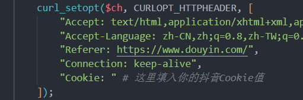
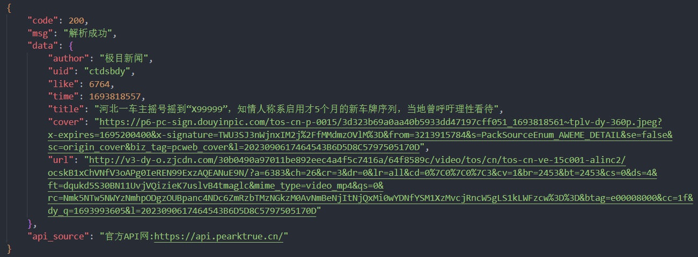

# DouYinParse

## 简介

`DouYinParse` 是一个用PHP编写的解析抖音视频信息的库。你可以通过这个库轻松地获取抖音视频的各种元数据，包括作者、抖音ID、点赞数、发布时间、视频标题、视频封面和无水印链接等。

## 安装

你可以通过Git将此库克隆到本地。

```bash
git clone https://github.com/PearNoDec/DouYinParse.git
```

或者下载ZIP压缩包并解压。

## 使用教程

### 注意事项

本项目自带Cookie值，如使用失效，请确保在 `SendGetData` 函数中添加自己的Cookie值。



### 示例用法(PearAPI站点)

这个库支持GET和POST协议进行请求，你可以传入短链接或者长链接。

```html
https://api.pearktrue.cn/api/video/douyin/?url=https://v.douyin.com/iererwFh/
```

[PearAPI](https://api.pearktrue.cn/)还支持聚合万能短视频解析平台(皮皮虾,抖音,快手,哔哩哔哩,虎牙视频,懂车帝,火山,皮皮虾,皮皮搞笑,最左,小影,趣头条,微博,迅雷,美图秀秀,秒拍,美拍,京东,淘宝,天猫,拼多多....)
还支持海外平台一键解析...

```html
https://api.pearktrue.cn/api/video/api.php?url=https://v.douyin.com/iererwFh/
```

输出的 `data` 数组将包括以下信息：

- `author`：作者
- `uid`：抖音ID
- `like`：点赞数
- `time`：发布时间
- `title`：视频标题
- `cover`：视频封面
- `video`：无水印链接



## 依赖

无特别依赖。

# 抖音X-Bogus校验

目前使用的 [https://github.com/B1gM8c/X-Bogus](https://github.com/B1gM8c/X-Bogus) 提供的服务

## 贡献

如果你有好的意见或建议，欢迎给我们提issue或者pull request。

贡献人：PearNo

## 协议

该项目遵循MIT协议。详见 [LICENSE](LICENSE) 文件。

## 联系方式

如果你有任何问题，可以通过邮箱 `pearhackone@gmail.com` 联系我。

---

希望这个`README.md`能帮助你更好地介绍和使用`DouYinParse`项目！
